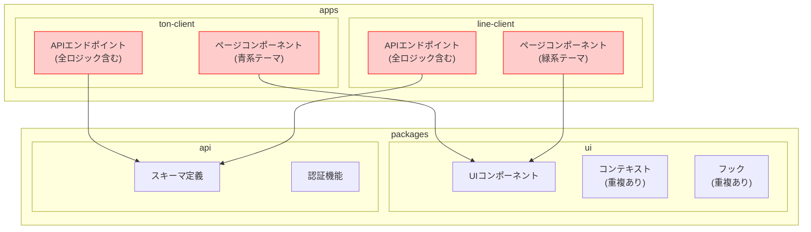
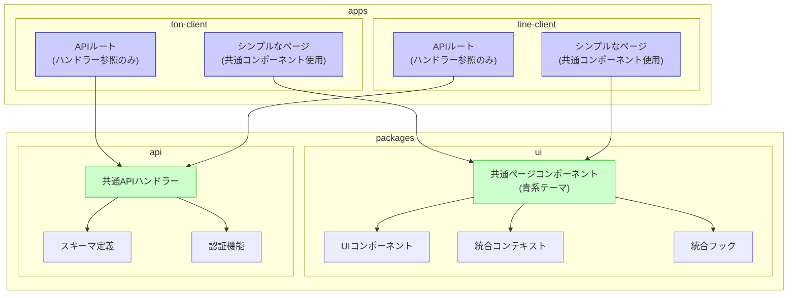
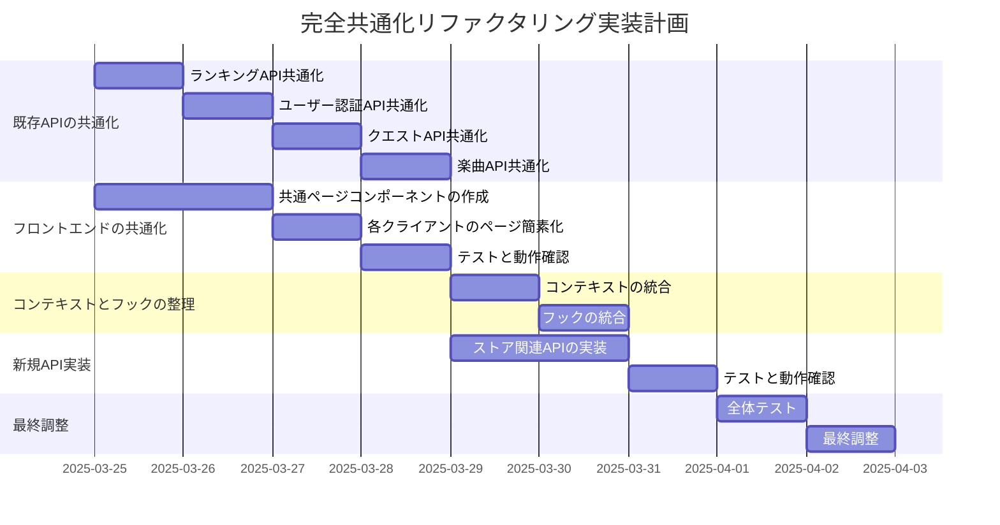

# リファクタリング計画

このドキュメントは、Shout2プロジェクトのリファクタリング計画を記録します。

## 目的

- コードの重複を削減し、保守性を向上させる
- 開発効率を向上させる
- ファイル数を削減し、ディレクトリ構造をシンプルにする
- 将来的な拡張性を高める

## 現状と目標

### 現状
- 2つのアプリ（LINE用とTelegram用）で同じコードが重複している
- APIエンドポイントも両方のアプリに同じものが存在している
- 認証、クエスト、楽曲、ランキング関連のAPIは実装済み
- ストア関連とソーシャル連携APIはこれから実装予定

### 目標
- 重複コードを削減し、共通部分を一元管理
- 色は青系に統一（プラットフォーム別の色分けは不要）
- ファイル数を増やさず、むしろ削減する
- リダイレクトを使わず、直接実装する形に
- ディレクトリ構造をシンプルに整理

## ビフォー・アフター図解

### 現在の構造（ビフォー）



### リファクタリング後の構造（アフター）



## 実装計画



## 実装フェーズ

### フェーズ1: 既存APIの共通化（4日間）

#### 目標
- 既存のAPIロジックを共通化し、重複を排除する
- 既存のAPIを移行し、今後のAPI実装の基盤を作る

#### 手順

1. **共通APIハンドラーの作成**
   ```
   packages/api/src/handlers/
   ├── auth.ts        # 認証関連ハンドラー
   ├── rankings/      # ランキング関連ハンドラー
   │   ├── types.ts   # 型定義
   │   ├── utils.ts   # 共通ユーティリティ関数
   │   ├── weekly.ts  # 週間ランキングハンドラー
   │   ├── monthly.ts # 月間ランキングハンドラー
   │   ├── all-time.ts # 総合ランキングハンドラー
   │   └── index.ts   # エクスポート用インデックス
   ├── quests.ts      # クエスト関連ハンドラー
   ├── songs.ts       # 楽曲関連ハンドラー
   ├── users.ts       # ユーザー関連ハンドラー
   └── store.ts       # ストア関連ハンドラー（スケルトン）
   ```

2. **各クライアントのAPIルートを簡素化**
   ```typescript
   // apps/ton-client/src/app/api/rankings/weekly/route.ts
   import { getWeeklyRankings } from '@shout2/api/src/handlers/rankings';
   
   export { getWeeklyRankings as GET };
   ```

3. **テストと動作確認**
   - 既存のAPIが正常に動作することを確認
   - 新しいAPIスケルトンが正しく設定されていることを確認

### フェーズ2: フロントエンドの共通化（4日間）

#### 目標
- 重複しているページコンポーネントを共通化
- 各クライアントのページを簡素化
- 青系の色に統一

#### 手順

1. **共通ページコンポーネントの作成**
   ```
   packages/ui/src/pages/
   ├── HomePage.tsx
   ├── RankingsPage.tsx
   ├── SettingsPage.tsx
   ├── StorePage.tsx
   ├── ProfilePage.tsx
   ├── PreGamePage.tsx
   ├── GamePage.tsx
   └── PlayPage.tsx
   ```

2. **各クライアントのページを簡素化**
   ```typescript
   // apps/ton-client/src/app/home/page.tsx
   'use client';
   
   import HomePage from '@shout2/ui/src/pages/HomePage';
   
   export default HomePage;
   ```

3. **テストと動作確認**
   - 各ページが正常に動作することを確認
   - 青系のスタイルが正しく適用されていることを確認

### フェーズ3: コンテキストとフックの整理（2日間）

#### 目標
- 重複しているコンテキストとフックを整理
- 不要なファイルを削除

#### 手順

1. **コンテキストの統合**
   - `NavigationContext.tsx`と`NextNavigationContext.tsx`を統合
   - 不要なコンテキストを削除

2. **フックの統合**
   - `useScreenAnimation.ts`と`useNextScreenAnimation.ts`を統合
   - `useScreenEntryExit.ts`と`useNextScreenEntryExit.ts`を統合

3. **不要なファイルの削除**
   - 統合後の不要なファイルを削除
   - 参照を更新

### フェーズ4: 新規API実装（3日間）

#### 目標
- ストア関連のAPIエンドポイントを実装
- 共通化パターンを使用して実装

#### 手順

1. **ストア関連のAPIハンドラー実装**
   ```typescript
   // packages/api/src/handlers/store.ts
   import { NextRequest, NextResponse } from 'next/server';
   import { createClient } from '@supabase/supabase-js';
   import { z } from 'zod';
   import { ApiError, ErrorCode } from '../schemas/error';
   import { ItemType, ItemRarity } from '../schemas/store';
   
   export async function getStoreItems(request: NextRequest) {
     // 商品一覧取得ロジック
   }
   
   export async function getStoreItem(request: NextRequest, { params }: { params: { id: string } }) {
     // 商品詳細取得ロジック
   }
   
   export async function purchaseItem(request: NextRequest, { params }: { params: { id: string } }) {
     // 商品購入ロジック
   }
   
   export async function getPurchases(request: NextRequest) {
     // 購入履歴取得ロジック
   }
   
   export async function getInventory(request: NextRequest) {
     // インベントリ取得ロジック
   }
   ```

2. **各クライアントのAPIルート実装**
   ```typescript
   // apps/ton-client/src/app/api/store/items/route.ts
   import { getStoreItems } from '@shout2/api/src/handlers/store';
   
   export { getStoreItems as GET };
   ```

### フェーズ5: 最終調整とテスト（2日間）

#### 目標
- 全体の動作を確認
- 残った問題を修正

#### 手順

1. **全体テスト**
   - すべてのページとAPIが正常に動作することを確認
   - エラーケースのテスト

2. **最終調整**
   - 残った問題の修正
   - パフォーマンスの確認

## 期待される効果

1. **コード量の削減**
   - 重複コードが大幅に削減される
   - 新機能の実装が1回で済むようになる

2. **保守性の向上**
   - バグ修正が1箇所で済むようになる
   - コードの見通しが良くなる

3. **開発効率の向上**
   - 新機能の追加が容易になる
   - テストが効率化される

4. **ファイル数の削減**
   - 重複ファイルが削除される
   - ディレクトリ構造がシンプルになる

## 進捗管理

| フェーズ | タスク | 状態 | 完了日 |
|---------|-------|------|-------|
| 1 | ランキングAPI共通化 | 完了 | 2025-03-22 |
| 1 | ユーザー認証API共通化 | 完了 | 2025-03-22 |
| 1 | 楽曲API共通化 | 完了 | 2025-03-22 |
| 1 | クエストAPI共通化 | 完了 | 2025-03-22 |
| 2 | 共通ページコンポーネントの作成 | 未着手 | - |
| 2 | 各クライアントのページ簡素化 | 未着手 | - |
| 2 | テストと動作確認 | 未着手 | - |
| 3 | コンテキストの統合 | 未着手 | - |
| 3 | フックの統合 | 未着手 | - |
| 4 | ストア関連APIの実装 | 未着手 | - |
| 4 | テストと動作確認 | 未着手 | - |
| 5 | 全体テスト | 未着手 | - |
| 5 | 最終調整 | 未着手 | - |
